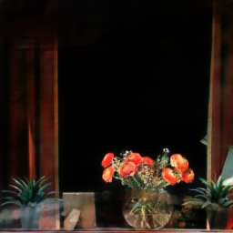

#pix2pix-tensorflow

TensorFlow implementation of [Image-to-Image Translation Using Conditional Adversarial Networks](https://arxiv.org/pdf/1611.07004v1.pdf) that learns a mapping from input images to output images. 

Here we trained the same network to translate from images with reflection to pure background images. 

Some of the results can be seen here. 
 

